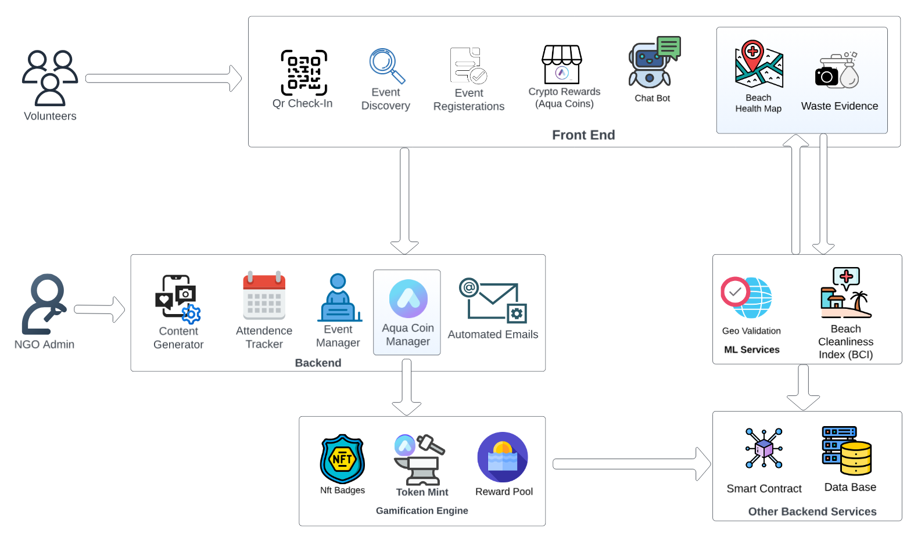

# Tidey

## About This Project

**Tidey** is a blockchain-powered, gamified platform for beach conservation. It transforms beach cleanup initiatives through technology-driven engagement and transparent impact tracking, serving as a central hub that connects environmental volunteers, NGOs, and coastal communities. Tidey coordinates large-scale cleanup efforts and addresses the fragmentation in current sustainability initiatives.

## Our Approach
Tidey provides a unified ecosystem where volunteers can discover nearby events, track their personal environmental contributions, and receive blockchain-verified recognition as proof of environment and impact. The platform combines real-time beach health monitoring with intelligent volunteer matching algorithms, ensuring optimal resource allocation and maximum environmental impact.

---
## System Architecture

Architecture diagram above for a high-level overview of Tidey's system workflow.

---
## Core Features

### 1. Beach Health Map System
- Visual representation of beach cleanliness levels (0-100 rating scale)
- Color-coded mapping to prioritize cleanup efforts based on pollution severity
- Real-time updates based on volunteer contributions and waste data
- Predictive analytics for resource deployment optimization
- Health score for each beach is ML-estimated using past cleanup volumes, waste-type ratios, and recency of activity

### 2. Smart Volunteer Management
- Deterministic scoring algorithm for beach assignment based on proximity and interests
- QR code-based check-in system for attendance verification
- Automated email notifications and event reminders
- Role-based access control for volunteers, coordinators, and administrators
- Avatar-based chatbot with volunteer FAQs for onboarding, guidance, and multilingual support

### 3. Waste & Impact Analytics
- Category-wise waste logging (Plastic, Metal, Glass, Organic)
- Geo-tagged data collection with volume/weight estimation
- Real-time dashboard with interactive charts and visualizations
- Exportable reports for NGOs and environmental agencies
- Automated post-event email outreach using pre-generated templates and dynamic event-specific injection

### 4. Gamification & TideyCoin Reward using Blockchain
- ERC-20 tokens on Polygon for low-cost, transparent NFT certificates for 10 environmental milestones
- Achievement system with prestige levels for ongoing engagement
- Real-time leaderboards and blockchain-verified badges to showcase achievements
- Referral program with bonus TideyCoins to boost community growth
- Redeem TideyCoins for eco-friendly rewards via the AquaStore

---

## Get Involved

Join us in making a measurable impact on Mumbai's beaches. Whether you're a volunteer, NGO, or community leader, Tidey empowers you to drive real environmental change